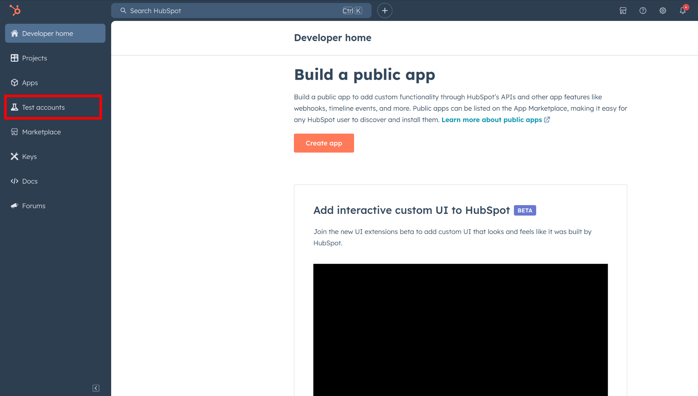
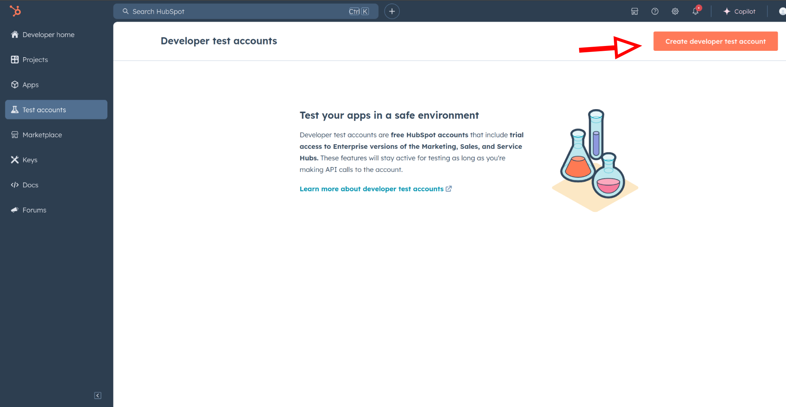
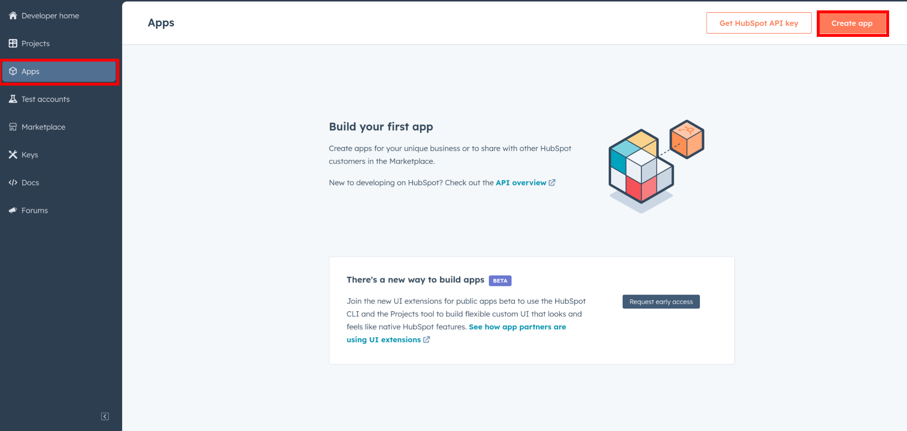
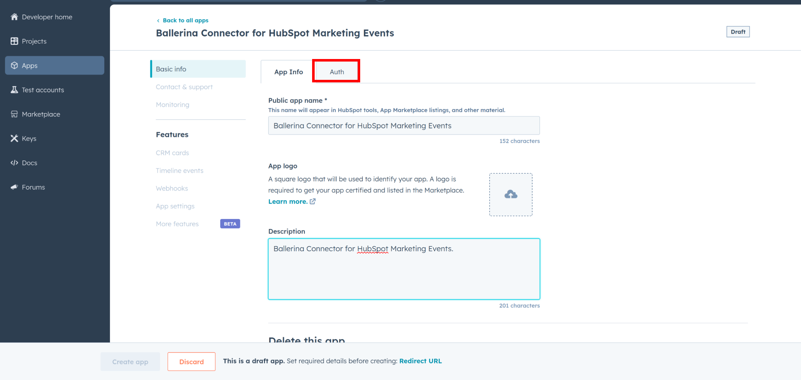
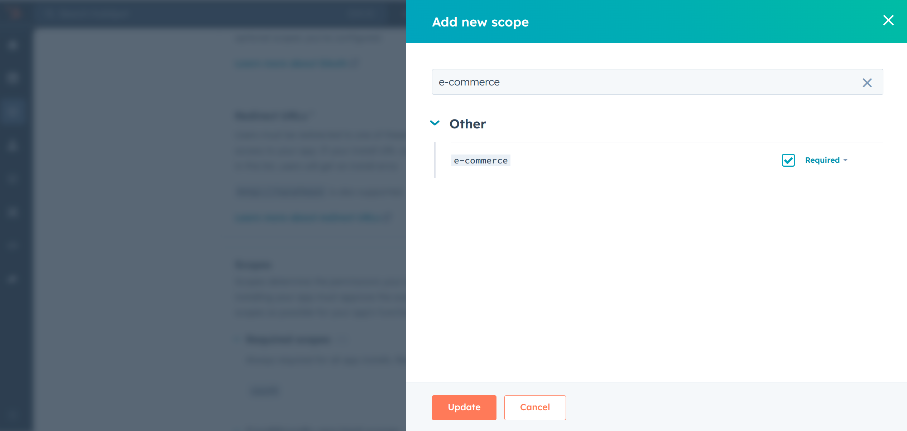
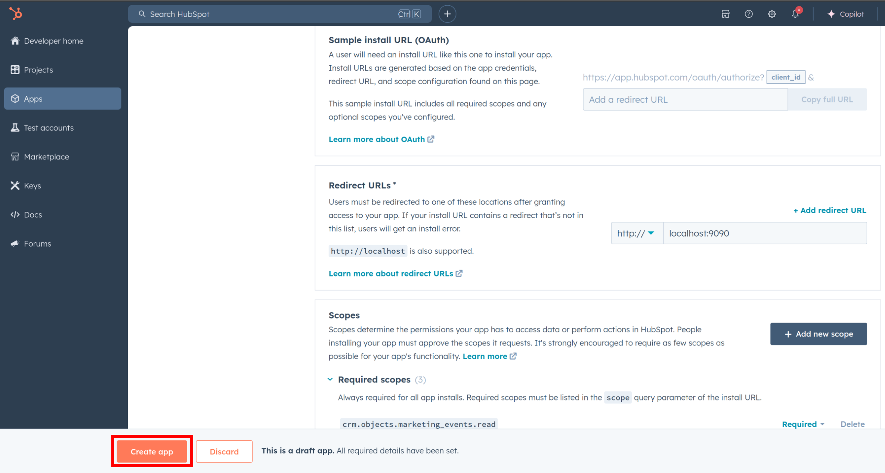
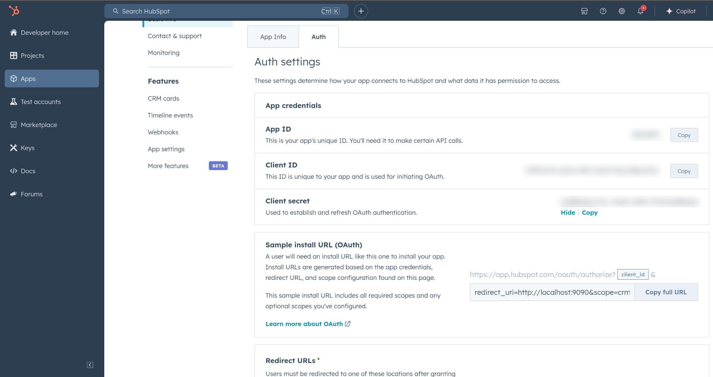
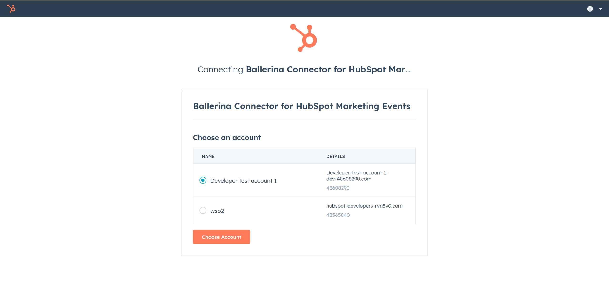

## Overview

[//]: # (TODO: Add overview mentioning the purpose of the module, supported REST API versions, and other high-level details.)

[HubSpot](https://www.hubspot.com/our-story) is an AI-powered customer relationship management (CRM) platform.  

The `ballerinax/hubspot.crm.object.products` package offers APIs to connect and interact with [HubSpot API for CRM Object Products](https://developers.hubspot.com/docs/reference/api/crm/objects/products) endpoints, specifically based on [HubSpot CRM Object Products API v3 OpenAPI spec](https://github.com/HubSpot/HubSpot-public-api-spec-collection/blob/main/PublicApiSpecs/CRM/Products/Rollouts/424/v3/products.json).

Use the products API to create and manage your product library, which is the collection of goods and services that your company offers. Products in your product library can be used as line items when creating deals, payment links, invoices, and quotes.

## Setup guide

[//]: # "TODO: Add detailed steps to obtain credentials and configure the module."

To use the HubSpot CRM Object Products connector, you must have access to the HubSpot API through a HubSpot developer account and a HubSpot App under it. Therefore you need to register for a developer account at HubSpot if you don't have one already.

### Step 1: Create/Login to a HubSpot Developer Account

If you have an account already, go to the [HubSpot developer portal](https://app.hubspot.com/)

If you don't have a HubSpot Developer Account you can sign up to a free account [here](https://developers.hubspot.com/get-started)

### Step 2 (Optional): Create a [Developer Test Account](https://developers.hubspot.com/beta-docs/getting-started/account-types#developer-test-accounts) under your account

Within app developer accounts, you can create developer test accounts to test apps and integrations without affecting any real HubSpot data.

**_These accounts are only for development and testing purposes. In production you should not use Developer Test Accounts._**

1. Go to Test Account section from the left sidebar.



2. Click Create developer test account. In the dialogue box, give a name to your test account and click create.



### Step 3: Create a HubSpot App under your account.

1. In your developer account, navigate to the "Apps" section. Click on "Create App"



2. Provide the necessary details, including the app name and description.

### Step 4: Configure the Authentication Flow.

1. Move to the Auth Tab.



2. In the Scopes section, add the following scope for your app using the "Add new scope" button.

   `e-commerce`



3. Add your Redirect URI in the relevant section. You can also use localhost addresses for local development purposes. Click Create App.



### Step 5: Get your Client ID and Client Secret

- Navigate to the Auth section of your app. Make sure to save the provided Client ID and Client Secret.



### Step 6: Setup Authentication Flow

Before proceeding with the Quickstart, ensure you have obtained the Access Token using the following steps:

1. Create an authorization URL using the following format:

   ```
   https://app.hubspot.com/oauth/authorize?client_id=<YOUR_CLIENT_ID>&scope=<YOUR_SCOPES>&redirect_uri=<YOUR_REDIRECT_URI>
   ```

   Replace the `<YOUR_CLIENT_ID>`, `<YOUR_REDIRECT_URI>` and `<YOUR_SCOPES>` with your specific value.

   **_NOTE: If you are using a localhost redirect url, make sure to have a listner running at the relevant port before executing the next step. You can use [this gist](https://gist.github.com/lnash94/0af47bfcb7cc1e3d59e06364b3c86b59) and run it using `bal run`. Alternatively, you can use any other method to bind a listner to the port._**

2. Paste it in the browser and select your developer test account to intall the app when prompted.



3. A code will be displayed in the browser. Copy the code.

4. Run the following curl command. Replace the `<YOUR_CLIENT_ID>`, `<YOUR_REDIRECT_URI`> and `<YOUR_CLIENT_SECRET>` with your specific value. Use the code you received in the above step 3 as the `<CODE>`.

   - Linux/macOS

     ```bash
     curl --request POST \
     --url https://api.hubapi.com/oauth/v1/token \
     --header 'content-type: application/x-www-form-urlencoded' \
     --data 'grant_type=authorization_code&code=<CODE>&redirect_uri=<YOUR_REDIRECT_URI>&client_id=<YOUR_CLIENT_ID>&client_secret=<YOUR_CLIENT_SECRET>'
     ```

   - Windows

     ```bash
     curl --request POST ^
     --url https://api.hubapi.com/oauth/v1/token ^
     --header 'content-type: application/x-www-form-urlencoded' ^
     --data 'grant_type=authorization_code&code=<CODE>&redirect_uri=<YOUR_REDIRECT_URI>&client_id=<YOUR_CLIENT_ID>&client_secret=<YOUR_CLIENT_SECRET>'
     ```

   This command will return the access token necessary for API calls.

   ```json
   {
     "token_type": "bearer",
     "refresh_token": "<Refresh Token>",
     "access_token": "<Access Token>",
     "expires_in": 1800
   }
   ```

5. Store the access token securely for use in your application.

## Quickstart

[//]: # (TODO: Add a quickstart guide to demonstrate a basic functionality of the module, including sample code snippets.)

## Examples

The `Ballerina HubSpot CRM Products Connector` provides practical examples illustrating usage in various scenarios. Explore these [examples](https://github.com/module-ballerinax-hubspot.crm.object.products/tree/main/examples/), covering the following use cases:

[//]: # (TODO: Add examples)
